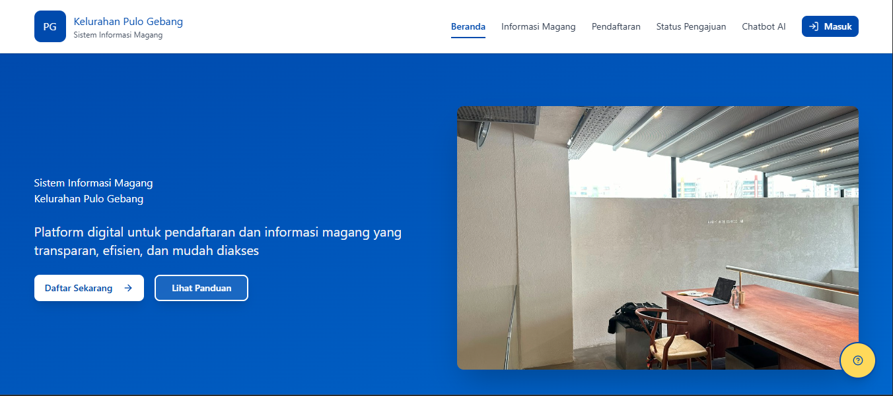
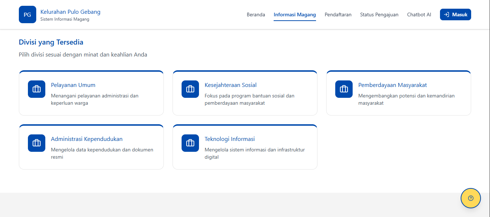

<h1 align="center">Sistem Informasi Magang</h1>

<p align="center">
  
</p>
<h4 align="center">by TwentyOne Team</h4>

<p align="center">
  <a href="https://maps.app.goo.gl/7KvGrbhztdbDVZbz6">
    
  </a>
  <a href="">
    
  </a>
  <a href="https://vitejs.dev/">
    
  </a>
  <a href="https://www.typescriptlang.org/">
    
  </a>
  <a href="https://opensource.org/licenses/MIT">
    
  </a>
</p>

<p align="center">
  Front-end website for the Internship Information System at Kelurahan Pulo Gebang.
</p>

---

## 📋 Table of Contents
- [📖 About](#-about)
- [✨ Features](#-features)
- [🛠️ Tech Stack](#%EF%B8%8F-tech-stack)
- [🚀 Getting Started](#-getting-started)
  - [🔎 Prerequisites](#-prerequisites)
  - [💾 Installation](#-installation)
  - [💻 Running Locally](#-running-locally)
- [🖼️ Screenshots](#%EF%B8%8F-screenshots)
- [🤝 Contributing](#-contributing)
- [⚖️ License](#%EF%B8%8F-license)
- [🙏 Acknowledgements](#-acknowledgements)

---

## 📖 About

**magang-pulogebang-vite** is a modern front-end application designed for the Internship Information System (Sistem Informasi Magang) of Kelurahan Pulo Gebang. Built with TypeScript and Vite, this project offers a fast and smooth development experience for both contributors and users. The system helps candidates easily register and track their internship applications in Kelurahan Pulo Gebang.

---

## ✨ Features

- User-friendly registration and application process
- Responsive UI design for mobile and desktop
- Dashboard for applicants to monitor their application status
- Integrated chatbot for instant support and information

---

## 🛠️ Tech Stack

- **TypeScript (TSX)** (v5.9.3)
- **Vite** (v7.2.4)
- **React** (v18.3.1)
- **TailwindCSS** (v4.1.17)

---

## 🚀 Getting Started

Follow these instructions to set up the project locally.

### 🔎 Prerequisites

- [Node.js](https://nodejs.org/) (v16 or later recommended)
- [npm](https://www.npmjs.com/) or [Yarn](https://yarnpkg.com/)

### 💾 Installation

```bash
git clone https://github.com/TwentyOneTeam/magang-pulogebang-vite.git
cd magang-pulogebang-vite
npm install
# or
yarn install
```

### 💻 Running Locally

```bash
npm run dev
# or
yarn dev
```
Visit [http://localhost:3000](http://localhost:3000) to view the app in your browser.

### 📦 Building for Production

```bash
npm run build
# or
yarn build
```
The optimized build output will be in the `dist/` folder.

---

## 🖼️ Screenshots

<p align="center">
  
</p>
<p align="center">
  
</p>

---

## 🤝 Contributing

Contributions are welcome! To contribute:

1. Fork this repository
2. Create a new branch (`git checkout -b feature/your-feature`)
3. Commit your changes (`git commit -m 'Add some feature'`)
4. Push to the branch (`git push origin feature/your-feature`)
5. Open a Pull Request

---

## ⚖️ License

This project is licensed under the MIT License. See [LICENSE](LICENSE) for more information.

---

## 🙏 Acknowledgements

- [Vite](https://vite.dev/)
- [TypeScript](https://www.typescriptlang.org/)
- And all contributors who help improve this project.

<p align="center">
  Made with ❤️ by the <b>TwentyOne Team</b>!
</p>